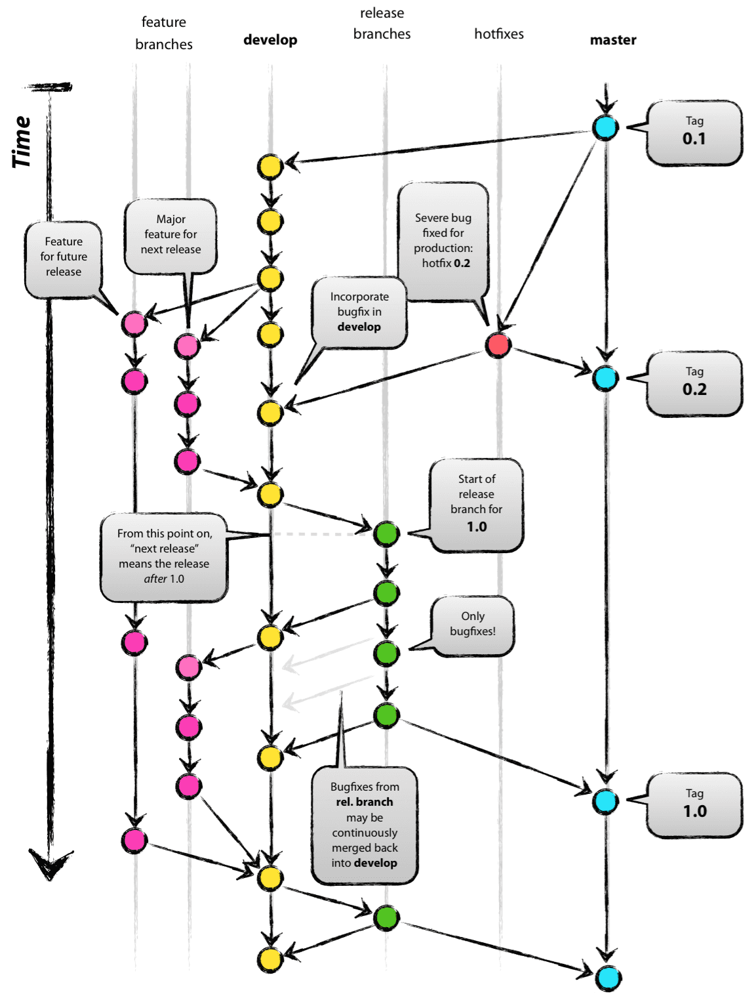

I was asked recently about the best practice for using GitFlow with continuous integration. For those who do not know, this is GitFlow:

<!--more-->

There is no CI good practice that includes GitFlow. For continuous integration to meet the definition, these are the good practices:

- Developers must implement **all** tests before they commit code. This is a non-negotiable and I will not work with developers who refuse to test. Professionals deliver working, tested code. Script kiddies don’t test.
- Use CI automation to trigger builds for every pull request so that bad changes can be rejected before code review.
- Ensure that all tests are executed and linting and static code analysis is done for every PR.
- Implement CI practices:
  - All developers branch from the trunk, make changes, and submit PRs back to trunk. 
  - The branches are removed in less than 24 hours.
  
You’re now doing Trunk Based Development. Welcome to your CI/CD journey!

The complexity of the CI automation will depend on how poorly the application is architected and the size of the development team. Monoliths with poor sub-domain boundaries will require much more complicated test design and test execution will take much longer. Evolve The architecture into independent, loosely coupled sub-domains to improve delivery speed, reduce testing overhead, and improve stability, resilience, and scalability.

GitFlow does not increase quality or value delivery. It delays quality signal feedback to the developers, incentivizes manual process, and is incredibly wasteful of time and resources. No modern development uses it.

Some developers have a religion built around GitFlow because it reduces typing (reduced pain from not testing) and they don’t track their levels of re-work, lost changes, or conflict resolution. In 2010, GitFlow felt good. We could keep Master “clean”. That was almost a decade ago. Testing was still mostly manual. We were still on Java 6. NodeJS was barely a thing. Time to modernize. We don't keep Master clean with process. We keep it clean with automation.

Other examples:
- [The Amazing DevOps Transformation Of The HP LaserJet Firmware Team](https://itrevolution.com/the-amazing-devops-transformation-of-the-hp-laserjet-firmware-team-gary-gruver/)
- [What is Continuous Delivery?](https://continuousdelivery.com/)
  
This post orginally appeared on Medium. You can see other posts in the `5 Minute DevOps` series [there](https://medium.com/@bdfinst)