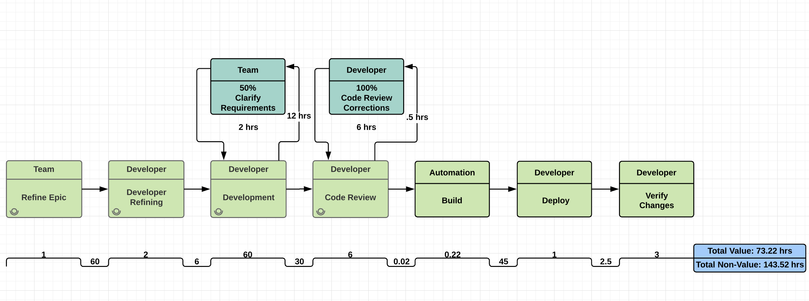
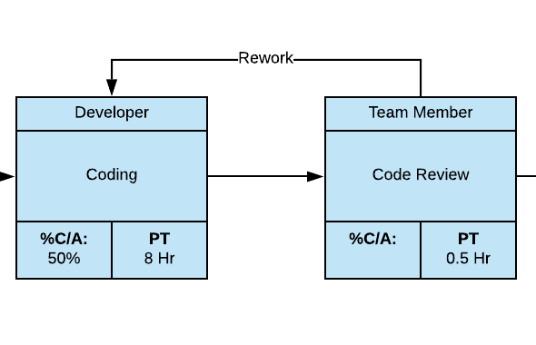
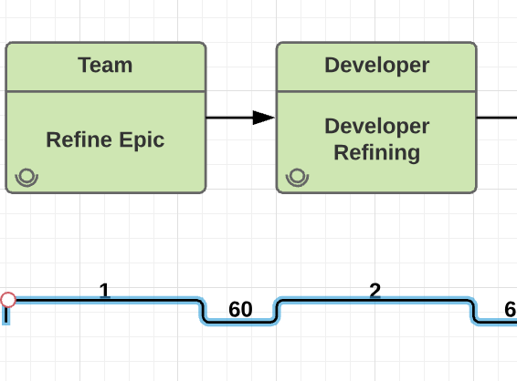
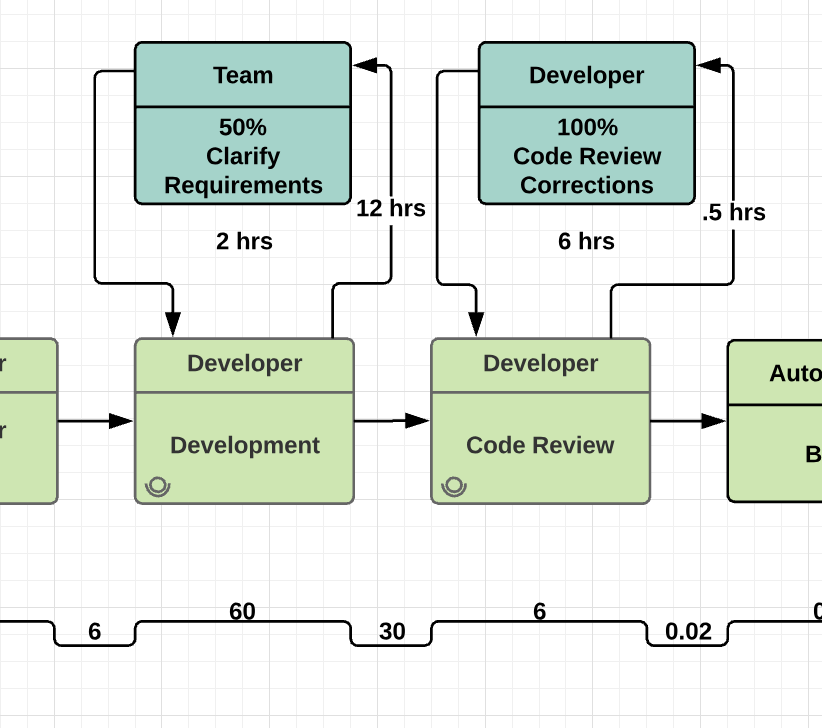

# {{ page.title }}

The purpose of Value Stream Mapping Workshop is to understand all of the steps needed to
deliver value from conception to production. We can then use it as a tool to
identify constraints and propose improvements to the value stream.

## Recommended Practices

1. Everyone who has a touch point in the value stream should be present for the
   exercise. This includes, but is not limited to, the developers, the
   engineering manager, the product owner, and representatives from any external
   teams that have required steps between idea and production.
2. Start with an introduction to what value stream mapping is, and why it is important.

### Explain the terms associated with value stream mapping

- Build Cycle Time: Total duration of the build, from commit to deploy.
- Development Cycle Time: The time from when work begins until it is deployed to production. Done.
- Lead Time: The time taken from start to end of the value stream.
- Process Time / Value Add Time: The time spent executing a particular process.
- Wait Time / Non-value Time: The time between processes where no activity is occurring.
- Percent Complete and Accurate: The percentage of work from a process that is
   rejected by the next process. If coding fails code review 20% of the time,
   it's %C/A is 80%.

### Identify source of request

*Example:* Refine Epic

For each source of _Requests_

  1. What is the outcome of that step, or next step?
  2. Who is involved in that step?
  3. How long does this step take?
  4. How long between the previous and current steps?

### Identify Rework Loops for each step

1. To which steps do we return to from this one for corrections?
2. How often is work rejected from this step (percentage complete and accurate)?

### Identify value added time, cycle time, and lead time

1. What is the total value time (time spent doing work) from conception to production?
2. What is the total non-value time (time waiting) from conception to production?

## Outcomes

- Visual representation of the value stream(s) of the team.
- Identify possible constraints to flow based on value added time, cycle time, and lead time.

## Sample Workshop Agenda
The below sample is for a 3 day workshop that focuses more on the flow of work and less on the numbers.  If you would like to go into more of the metrics extending the workshop to 5 days would allow for that.

#### Day 1
- Workshop working agreements
- Review of workshop charter
- Create/interate through current state value stream map

#### Day 2
- Refine Value Stream Map and add data points
- Identify waste and oppotunities to improve the flow of work
- Start future sate value stream map

#### Day 3
- Complete future state value stream map
- Document/prioritize Kiazen improvement opportunities

## Tips

- Involve all team members associated to any part of the process of getting value from conception to production.
- Review and maintain value stream map to show wins associated to implementing improvement.
- Take into account all potential flows for team processes, and value stream those as well.

## Value

As a team, we want to understand how to value stream map our team processes, so that we may understand bottlenecks associated to delivering value, and identify areas of improvement.

## Acceptance Criteria

- Value stream all things associated to delivering value.
- Create action items of improvement from exercise.

## References

- [Value Stream Mapping Guide](https://creately.com/blog/diagrams/value-stream-mapping-guide/)
- [Value Stream Mapping: How to Visualize Work and Align Leadership for Organizational Transformation](https://books.google.com/books/about/Value_Stream_Mapping_How_to_Visualize_Wo.html?id=MeFrAAAAQBAJ)

